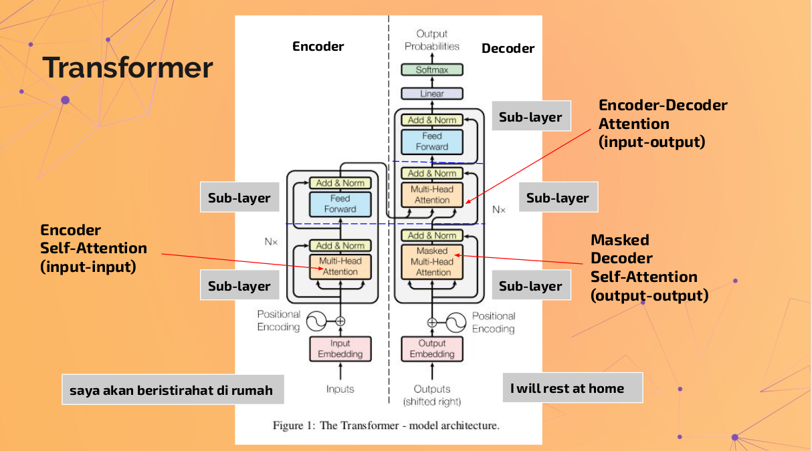

# indo-bert-news-classification
Indonesian BERT Fine Tuning News Classification

#### This repository is part of my seminar at "Melek For Member" (MFM) event which hold by Data Science Indonesia (DSI)

```
The title of seminar :
Implementasi Fine Tuning BERT untuk Indo News Classification menggunakan Hugging Face-PyTorch 
```

Dataset for Indonesian News is from : https://github.com/andreaschandra/indonesian-news

train label distribution | test label distribution
---|---
 | 

You can check my ```presentation.pdf``` for the detail and code in ```notebook``` folder

# Transformer Architecture

